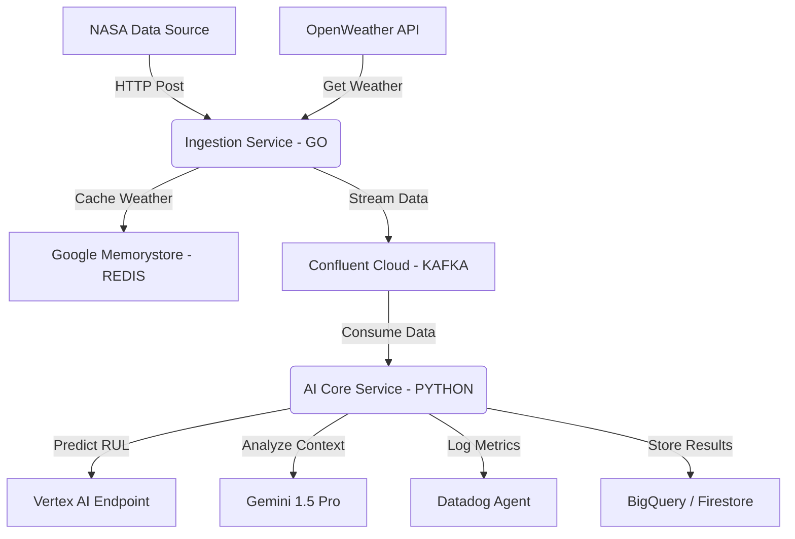
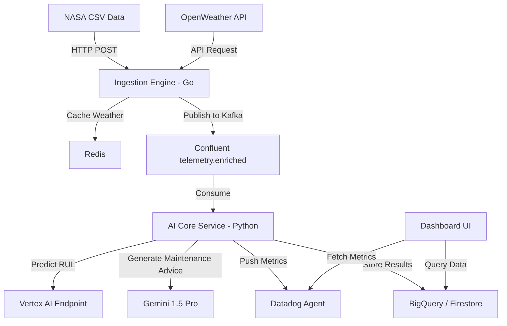

# 🚀 Aero-Sense: Intelligent Engine Health & MLOps Platform

**Hackathon:** Google Cloud Partner Hackathon (Datadog & Confluent Challenges)  
**Date:** December 2025  
**Architectural Style:** Event-Driven Microservices  
**Tech Stack:** Google Cloud Native (Cloud Run, Vertex AI) + Polyglot (Go, Python, TypeScript)  

---

# 1. 📄 Product Requirements Document (PRD)

## 1.1. Problem Statement
Havacılık sektöründe motor arızaları maliyetli ve tehlikelidir. Mevcut sistemler genellikle reaktiftir. Biz, Vertex AI ve Gemini kullanarak **predictive maintenance** sağlayan ve arıza durumunda otomatik teknik reçete oluşturan bir platform kuruyoruz.

## 1.2. Solution Overview
- NASA jet motoru verisi (simülasyon) + OpenWeatherMap API verisi birleştirilir.  
- AI Core (XGBoost + Gemini) motorun Kalan Ömrünü (RUL) tahmin eder.  
- Datadog üzerinden uçtan uca gözlemlenebilirlik sağlanır.  

## 1.3. Key Features
- High-Performance Ingestion (Golang)  
- Hybrid Data Stream (Kafka)  
- AI Core (Vertex AI + Gemini)  
- Full Observability (Datadog)  

---

# 2. 🏗️ Technical Specifications & Architecture

## 2.1. System Architecture Diagram


## 2.2. Tech Stack Details

| Component  | Technology        | Google Cloud Service | Reason                          |
|------------|-----------------|-------------------|--------------------------------|
| Ingestion  | Go (Golang)     | Cloud Run         | High throughput, low CPU       |
| Processing | Python (FastAPI)| Cloud Run         | Rich AI ecosystem              |
| ML Model   | XGBoost         | Vertex AI Training| Strong for tabular sensor data |
| GenAI      | Gemini 1.5 Pro  | Vertex AI Studio  | Multimodal reasoning           |
| Streaming  | Kafka           | Confluent Cloud   | Reliable event streaming       |
| Cache      | Redis           | Memorystore       | Reduces API latency            |
| Frontend   | Next.js         | Cloud Run         | SSR + modern UI                |
| Infra      | Terraform       | —                 | IaC                            |
| Monitoring | Datadog         | —                 | Full observability             |

---

# 3. 🧩 Microservices Specification

### Service A: ingestion-engine (Golang)
- **Role:** Data Producer  
- **Responsibilities:** NASA CSV satır satır okur, Redis cache → OpenWeather fallback, Sensor+Weather → Kafka  
- **Libraries:** sarama, redigo, gin  

### Service B: ai-core (Python)
- **Role:** Data Consumer & Intelligence  
- **Responsibilities:** Kafka → Vertex AI → Predicted_RUL, Gemini prompt → maintenance advice, metrics → Datadog  
- **Libraries:** confluent-kafka, google-cloud-aiplatform, datadog, fastapi  

### Service C: dashboard-ui (Next.js/TS)
- **Role:** User Interface  
- **Responsibilities:** RUL gauge, Google Maps plane + weather, Datadog graphs, Gemini maintenance  
- **Libraries:** framer-motion, google-maps-react, tailwindcss  

---

# 4. 📊 Data Schemas

## 4.1. Kafka Message Payload
```json
{
  "flight_id": "FL-2025-NY",
  "timestamp": "2025-12-06T10:00:00Z",
  "location": {"lat": 40.7128,"lon": -74.0060},
  "external_context": {"temperature": 15.5,"humidity": 60},
  "sensors": {"fan_speed": 2388.05,"core_temp": 1400.2,"pressure": 554.3}
}
## 4.2. Datadog Custom Metrics
- **aero.ingestion.rate** – Messages per second (Go service)  
- **aero.weather.api_latency** – Time to fetch OpenWeatherMap API  
- **aero.model.rul_prediction** – Predicted remaining useful life  
- **aero.genai.cost** – Estimated cost of Gemini calls  
```
---

# 5. 🛠️ Implementation Plan

## 5.1. Directory Structure
/aero-sense-google-hackathon
├── /infra # Terraform files (GCP resources)
├── /services
│ ├── /ingestion-go # Golang Producer
│ ├── /ai-core-py # Python Consumer & Vertex Logic
│ └── /web-ui # Next.js Frontend
├── /data # Raw NASA datasets
├── /models # Training scripts for Vertex AI
└── /docs # Architecture images & PRD


## 5.2. Model Training
- **Model:** XGBoost regressor  
- **Platform:** Vertex AI Custom Training Job  
- **Artifact storage:** `gs://aero-sense-models/`  

---

# 6. 🎯 Success Criteria
- **Integration:** Confluent → Python → Vertex AI → Datadog  
- **Innovation:** Hybrid data (NASA + Live Weather)  
- **Google Native:** Cloud Run backend + Gemini integration  
- **Polyglot:** Go service performance optimized  
- **Observability:** Datadog dashboards actionable, not just logs  

---

# 7. 📘 Hackathon Requirements Mapping
- **Datadog:** Metrics, dashboards, detection rules, incidents  
- **Confluent:** Real-time data stream → AI prediction  
- **ElevenLabs (optional):** Voice-based maintenance assistant  

---

# 8. 🧮 Evaluation Strategy
- **Technological Implementation:** Cloud Run microservices, Vertex AI, Gemini, Kafka, Datadog  
- **Design & UX:** Real-time RUL gauge, Google Maps, Gemini advice, minimal UI  
- **Potential Impact:** Cost saving, safety improvement, cross-industry adaptability  
- **Quality of Idea:** Hybrid data + LLM-powered maintenance recommendations  

---

# 9. 📦 Compliance & Submission Checklist
- Hosted application URL  
- Public repo with OSI license, deployment instructions, Datadog config JSON  
- 3-minute demo video  
- Selected challenge: Datadog / Confluent / ElevenLabs  
- Traffic generator script for demonstrating real-time events  
- Google Cloud credits usage compliance  

---

# 10. 🔄 Data Flow & Event Lifecycle

## 10.1. Event Lifecycle Diagram

## 10.2. Event Handling Notes

- **Latency sensitive paths:** Ingestion → Kafka → AI Core

- **Failure handling:**  
  - Redis miss → OpenWeather fetch  
  - Kafka failures → retry 3x exponential backoff  
  - Vertex AI errors → log + fallback last prediction

- **Telemetry tracking:** ingestion rate, API latency, prediction time, model drift

- **Data persistence:** BigQuery analytics, Firestore real-time access

---

# 11. 👤 User Stories & Edge Cases

## 11.1. Primary User Stories
- **Maintenance Engineer:** Realtime RUL, plan maintenance efficiently  
- **DevOps / Monitoring Lead:** Track latency, model drift, automate alerts  
- **Product Owner / Manager:** View full data pipeline, dashboard reporting  

## 11.2. Edge Cases & Safeguards

| Edge Case                     | Mitigation                                |
|--------------------------------|------------------------------------------|
| Sensor missing/faulty data     | Interpolation / last value fallback      |
| OpenWeather API down           | Redis fallback / default values          |
| Kafka backlog high             | Metrics alerts → auto-scale ingestion    |
| Vertex AI downtime             | Cached predictions + Datadog alert       |
| Gemini API rate limit exceeded | Queue + retry + throttling               |

## 11.3. Benefits for Claude
- System logic, data flow, and failure scenarios are fully defined  
- User intents mapped to system reactions  
- Edge cases clarify fallback behaviors for AI understanding

    F[Frontend - Next.js] -->|Fetch Data| C
    F -->|Maps Visualization| M[Google Maps API]
