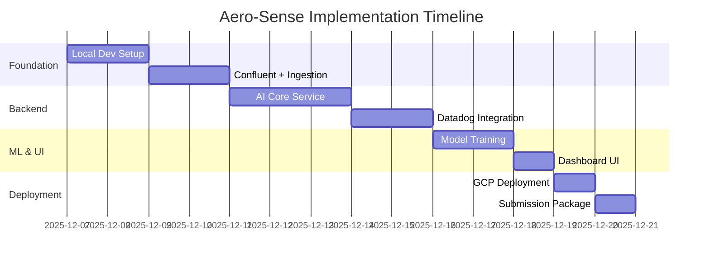

# 🎯 Aero-Sense: Hackathon Implementation Plan

**Project:** Aero-Sense - Intelligent Engine Health & MLOps Platform
**Hackathon:** Google Cloud Partner Hackathon (Datadog & Confluent Challenges)
**Timeline:** 14 Days
**Status:** Implementation Ready
**Last Updated:** December 7, 2025

---

## 📋 Table of Contents
1. [Hackathon Requirements Overview](#hackathon-requirements-overview)
2. [14-Day Implementation Timeline](#14-day-implementation-timeline)
3. [Detailed Phase Breakdown](#detailed-phase-breakdown)
4. [Technical Stack & Dependencies](#technical-stack--dependencies)
5. [Directory Structure](#directory-structure)
6. [Critical Deliverables](#critical-deliverables)
7. [Success Metrics](#success-metrics)

---

## 🏆 Hackathon Requirements Overview

### ✅ Datadog Challenge (Mandatory Requirements)

| Requirement | Implementation | Status |
|-------------|---------------|--------|
| **LLM-based Application** | Gemini 1.5 Pro for maintenance advice | ✓ Planned |
| **3+ Detection Rules** | RUL anomaly, Latency, Cost spike | ✓ Planned |
| **Incident/Case Creation** | Datadog webhook automation | ✓ Planned |
| **Dashboard + SLO** | Custom dashboard with model metrics | ✓ Planned |
| **Telemetry Streaming** | Custom metrics: aero.* namespace | ✓ Planned |
| **JSON Config Export** | dashboards/, monitors/, slos/ | ✓ Planned |
| **Traffic Generator** | Python script for load testing | ✓ Planned |

**Detection Rules (Minimum 3):**
1. **RUL Anomaly Alert** - Triggers when `aero.model.rul_prediction < 10`
2. **Inference Latency Alert** - Triggers when `aero.model.inference_latency > 2000ms`
3. **Gemini Cost Spike Alert** - Triggers when `aero.genai.cost` increases >200% in 5min

---

### ✅ Confluent Challenge (Mandatory Requirements)

| Requirement | Implementation | Status |
|-------------|---------------|--------|
| **Real-time Data Stream** | NASA sensor + live weather data | ✓ Planned |
| **Confluent Cloud** | Topic: `telemetry.enriched` | ✓ Planned |
| **AI on Data in Motion** | Kafka → Vertex AI → Real-time RUL | ✓ Planned |
| **Novel Use Case** | Predictive aircraft maintenance | ✓ Planned |
| **Trial Code** | CONFLUENTDEV1 (30-day trial) | ✓ Ready |

---

## 📅 14-Day Implementation Timeline

### Week 1: Core Infrastructure & Services



### Daily Breakdown

#### **Day 1-2: Foundation Setup**
- ✅ Project directory structure
- ✅ Docker Compose (Kafka, Redis, PostgreSQL)
- ✅ .env.example + .gitignore
- ✅ Go module initialization
- ✅ Python virtual environment
- ✅ NASA dataset download

**Deliverable:** Local development environment running

---

#### **Day 3-4: Confluent + Ingestion Service**
- ✅ Confluent Cloud account setup
- ✅ Kafka topic creation: `telemetry.enriched`
- ✅ Go Ingestion Service implementation
  - NASA CSV reader with streaming
  - OpenWeather API client
  - Redis caching layer
  - Kafka producer with retry logic
- ✅ Unit tests for Go service

**Deliverable:** Go service successfully publishes to Confluent Cloud

---

#### **Day 5-7: AI Core Service + Gemini**
- ✅ Python FastAPI application
- ✅ Kafka consumer (Confluent)
- ✅ Vertex AI client wrapper
- ✅ Gemini 1.5 Pro integration
  - Prompt engineering for maintenance advice
  - Threshold logic: RUL < 20
- ✅ Datadog StatsD client
- ✅ BigQuery/Firestore writers
- ✅ Integration tests

**Deliverable:** End-to-end pipeline: Kafka → AI Core → Gemini → Datadog

---

#### **Day 8-9: Datadog Observability (CRITICAL)**
- ✅ Datadog Agent installation
- ✅ Custom metrics implementation
  - `aero.ingestion.rate` (gauge)
  - `aero.weather.api_latency` (histogram)
  - `aero.model.rul_prediction` (gauge)
  - `aero.model.inference_latency` (histogram)
  - `aero.genai.cost` (gauge)
  - `aero.genai.tokens_used` (count)
- ✅ Dashboard creation
  - RUL trends over time
  - Kafka lag monitoring
  - API latency percentiles (p50, p95, p99)
  - Model drift detection
- ✅ 3 Detection Rules setup
- ✅ SLO definitions
  - Model inference latency SLO: 95% < 2s
  - Ingestion throughput SLO: >100 msg/sec
- ✅ Incident automation (webhook to Slack/PagerDuty)
- ✅ Export all configs to JSON

**Deliverable:** Fully instrumented observability stack with actionable alerts

---

#### **Day 10-11: Model Training & Deployment**
- ✅ NASA CMAPSS data preprocessing
- ✅ Feature engineering (sensor aggregations)
- ✅ XGBoost model training
  - Hyperparameter tuning
  - Cross-validation
  - Model evaluation (RMSE, MAE)
- ✅ Vertex AI custom training job
- ✅ Model deployment to endpoint
- ✅ Update AI Core to use production endpoint
- ✅ Model monitoring setup

**Deliverable:** Production-grade RUL prediction model

---

#### **Day 12: Dashboard UI**
- ✅ Next.js 14 application setup
- ✅ Components:
  - RUL Gauge (Recharts)
  - Real-time telemetry table
  - Google Maps integration with aircraft markers
  - Weather overlay
  - Datadog dashboard embed (iframe)
  - Gemini advice panel (Markdown rendering)
- ✅ SWR for real-time data fetching
- ✅ Tailwind CSS styling
- ✅ Responsive design

**Deliverable:** Functional web dashboard

---

#### **Day 13: GCP Deployment**
- ✅ Terraform infrastructure
  - Cloud Run services (3x)
  - Memorystore (Redis)
  - BigQuery dataset
  - Firestore database
  - VPC networking
  - IAM roles & permissions
- ✅ Docker images build & push to GCR
- ✅ Environment variables configuration
- ✅ Cloud Run deployment
- ✅ DNS & SSL setup
- ✅ Load testing

**Deliverable:** Live application URLs

---

#### **Day 14: Submission Package**
- ✅ Traffic generator script
- ✅ 3-minute demo video recording
- ✅ Datadog JSON exports
- ✅ README.md update with deployment instructions
- ✅ LICENSE file (MIT)
- ✅ Architecture diagrams
- ✅ Final testing & QA
- ✅ Submission form completion

**Deliverable:** Complete hackathon submission

---

## 🛠️ Detailed Phase Breakdown

### Phase 1: Foundation Setup

#### Directory Structure
```
aero-sense/
├── .github/
│   └── workflows/
│       ├── ci.yml
│       └── cd.yml
├── infra/
│   ├── main.tf
│   ├── variables.tf
│   ├── outputs.tf
│   └── modules/
│       ├── cloud-run/
│       ├── memorystore/
│       ├── vertex-ai/
│       └── monitoring/
├── services/
│   ├── ingestion-go/
│   │   ├── cmd/
│   │   │   └── main.go
│   │   ├── internal/
│   │   │   ├── handlers/
│   │   │   │   ├── health.go
│   │   │   │   └── ingest.go
│   │   │   ├── kafka/
│   │   │   │   ├── producer.go
│   │   │   │   └── message.go
│   │   │   ├── weather/
│   │   │   │   └── client.go
│   │   │   ├── cache/
│   │   │   │   └── redis.go
│   │   │   └── models/
│   │   │       └── telemetry.go
│   │   ├── Dockerfile
│   │   ├── go.mod
│   │   └── go.sum
│   ├── ai-core-py/
│   │   ├── app/
│   │   │   ├── main.py
│   │   │   ├── kafka_consumer.py
│   │   │   ├── vertex_client.py
│   │   │   ├── gemini_client.py
│   │   │   ├── datadog_metrics.py
│   │   │   ├── storage.py
│   │   │   └── models.py
│   │   ├── tests/
│   │   ├── Dockerfile
│   │   ├── requirements.txt
│   │   └── pyproject.toml
│   └── web-ui/
│       ├── src/
│       │   ├── app/
│       │   │   ├── page.tsx
│       │   │   └── layout.tsx
│       │   ├── components/
│       │   │   ├── RULGauge.tsx
│       │   │   ├── MapView.tsx
│       │   │   ├── TelemetryTable.tsx
│       │   │   ├── DatadogEmbed.tsx
│       │   │   └── MaintenanceAdvice.tsx
│       │   └── lib/
│       │       ├── api.ts
│       │       └── utils.ts
│       ├── public/
│       ├── Dockerfile
│       ├── package.json
│       ├── next.config.js
│       └── tailwind.config.js
├── models/
│   ├── train_xgboost.py
│   ├── preprocessing.py
│   ├── feature_engineering.py
│   ├── vertex_deploy.py
│   └── requirements.txt
├── data/
│   ├── train_FD001.txt
│   ├── test_FD001.txt
│   ├── RUL_FD001.txt
│   └── README.md
├── monitoring/
│   ├── dashboards/
│   │   └── aero-sense-main.json
│   ├── monitors/
│   │   ├── rul-anomaly.json
│   │   ├── inference-latency.json
│   │   └── gemini-cost-spike.json
│   └── slos/
│       ├── model-latency.json
│       └── ingestion-throughput.json
├── scripts/
│   ├── traffic-generator.py
│   ├── setup-confluent.sh
│   ├── deploy.sh
│   └── download-nasa-data.sh
├── docs/
│   ├── architecture.md
│   ├── api-reference.md
│   └── deployment-guide.md
├── docker-compose.yml
├── .env.example
├── .gitignore
├── LICENSE
├── README.md
├── CLAUDE.md
├── prd.md
├── requirement_analysis.md
└── IMPLEMENTATION_PLAN.md
```

#### Docker Compose Configuration
```yaml
version: '3.9'

services:
  kafka:
    image: confluentinc/cp-kafka:7.5.0
    ports:
      - "9092:9092"
    environment:
      KAFKA_BROKER_ID: 1
      KAFKA_ZOOKEEPER_CONNECT: zookeeper:2181
      KAFKA_ADVERTISED_LISTENERS: PLAINTEXT://localhost:9092
      KAFKA_OFFSETS_TOPIC_REPLICATION_FACTOR: 1

  zookeeper:
    image: confluentinc/cp-zookeeper:7.5.0
    ports:
      - "2181:2181"
    environment:
      ZOOKEEPER_CLIENT_PORT: 2181

  redis:
    image: redis:7-alpine
    ports:
      - "6379:6379"
    command: redis-server --appendonly yes

  postgres:
    image: postgres:15-alpine
    ports:
      - "5432:5432"
    environment:
      POSTGRES_DB: aerosense
      POSTGRES_USER: admin
      POSTGRES_PASSWORD: password

  datadog-agent:
    image: datadog/agent:latest
    environment:
      - DD_API_KEY=${DATADOG_API_KEY}
      - DD_SITE=datadoghq.com
      - DD_DOGSTATSD_NON_LOCAL_TRAFFIC=true
    ports:
      - "8125:8125/udp"
      - "8126:8126"
```

#### Environment Variables Template (.env.example)
```bash
# Google Cloud Platform
GCP_PROJECT_ID=aero-sense-prod
GCP_REGION=us-central1
GOOGLE_APPLICATION_CREDENTIALS=/path/to/service-account.json

# Vertex AI
VERTEX_AI_ENDPOINT_ID=your-endpoint-id
VERTEX_AI_LOCATION=us-central1
GEMINI_API_KEY=your-gemini-api-key

# OpenWeather API
OPENWEATHER_API_KEY=your-openweather-api-key

# Redis
REDIS_HOST=localhost
REDIS_PORT=6379
REDIS_PASSWORD=
REDIS_DB=0

# Confluent Cloud Kafka
KAFKA_BOOTSTRAP_SERVERS=pkc-xxx.us-central1.gcp.confluent.cloud:9092
KAFKA_SASL_USERNAME=your-api-key
KAFKA_SASL_PASSWORD=your-api-secret
KAFKA_TOPIC=telemetry.enriched
KAFKA_CONSUMER_GROUP=ai-core-consumers

# Datadog
DATADOG_API_KEY=your-datadog-api-key
DATADOG_APP_KEY=your-datadog-app-key
DATADOG_SITE=datadoghq.com

# BigQuery
BIGQUERY_DATASET=aero_sense
BIGQUERY_TABLE=predictions

# Firestore
FIRESTORE_COLLECTION=telemetry

# Application Settings
LOG_LEVEL=INFO
ENABLE_METRICS=true
BATCH_SIZE=100
```

---

### Phase 2: Confluent + Ingestion Service

#### Confluent Cloud Setup Steps
```bash
# 1. Create Confluent Cloud account
# Visit: https://confluent.cloud/signup
# Use promo code: CONFLUENTDEV1

# 2. Create Kafka cluster
# - Cluster type: Basic
# - Region: us-central1 (Google Cloud)
# - Cluster name: aero-sense-kafka

# 3. Create topic
# - Topic name: telemetry.enriched
# - Partitions: 3
# - Retention: 7 days

# 4. Create API Key
# Save the key and secret to .env file
```

#### Go Ingestion Service Key Components

**main.go**
```go
package main

import (
    "log"
    "github.com/gin-gonic/gin"
    "aero-sense/internal/handlers"
    "aero-sense/internal/kafka"
    "aero-sense/internal/cache"
)

func main() {
    // Initialize Redis
    redisClient := cache.NewRedisClient()

    // Initialize Kafka Producer
    kafkaProducer := kafka.NewProducer()
    defer kafkaProducer.Close()

    // Initialize Gin router
    r := gin.Default()

    // Health check
    r.GET("/health", handlers.HealthCheck)

    // Batch ingestion endpoint
    r.POST("/ingest/batch", handlers.BatchIngest(kafkaProducer, redisClient))

    log.Fatal(r.Run(":8080"))
}
```

**Kafka Producer (internal/kafka/producer.go)**
```go
package kafka

import (
    "github.com/IBM/sarama"
    "encoding/json"
)

type Producer struct {
    producer sarama.SyncProducer
}

func NewProducer() *Producer {
    config := sarama.NewConfig()
    config.Producer.Return.Successes = true
    config.Producer.RequiredAcks = sarama.WaitForAll
    config.Producer.Retry.Max = 3

    // Confluent Cloud configuration
    config.Net.SASL.Enable = true
    config.Net.SASL.Mechanism = sarama.SASLTypePlaintext
    config.Net.SASL.User = os.Getenv("KAFKA_SASL_USERNAME")
    config.Net.SASL.Password = os.Getenv("KAFKA_SASL_PASSWORD")

    producer, err := sarama.NewSyncProducer(
        []string{os.Getenv("KAFKA_BOOTSTRAP_SERVERS")},
        config,
    )
    if err != nil {
        log.Fatal(err)
    }

    return &Producer{producer: producer}
}

func (p *Producer) PublishTelemetry(msg TelemetryMessage) error {
    data, err := json.Marshal(msg)
    if err != nil {
        return err
    }

    message := &sarama.ProducerMessage{
        Topic: os.Getenv("KAFKA_TOPIC"),
        Value: sarama.ByteEncoder(data),
    }

    _, _, err = p.producer.SendMessage(message)
    return err
}
```

**Weather API Client (internal/weather/client.go)**
```go
package weather

import (
    "encoding/json"
    "net/http"
    "fmt"
)

type WeatherClient struct {
    apiKey string
    baseURL string
}

type WeatherData struct {
    Temperature float64 `json:"temperature"`
    Humidity    int     `json:"humidity"`
    Pressure    float64 `json:"pressure"`
}

func NewWeatherClient(apiKey string) *WeatherClient {
    return &WeatherClient{
        apiKey: apiKey,
        baseURL: "https://api.openweathermap.org/data/2.5/weather",
    }
}

func (w *WeatherClient) GetWeather(lat, lon float64) (*WeatherData, error) {
    url := fmt.Sprintf("%s?lat=%f&lon=%f&appid=%s&units=metric",
        w.baseURL, lat, lon, w.apiKey)

    resp, err := http.Get(url)
    if err != nil {
        return nil, err
    }
    defer resp.Body.Close()

    var result struct {
        Main struct {
            Temp     float64 `json:"temp"`
            Humidity int     `json:"humidity"`
            Pressure float64 `json:"pressure"`
        } `json:"main"`
    }

    if err := json.NewDecoder(resp.Body).Decode(&result); err != nil {
        return nil, err
    }

    return &WeatherData{
        Temperature: result.Main.Temp,
        Humidity:    result.Main.Humidity,
        Pressure:    result.Main.Pressure,
    }, nil
}
```

---

### Phase 3: AI Core Service

#### Python FastAPI Application Structure

**app/main.py**
```python
from fastapi import FastAPI
from contextlib import asynccontextmanager
import asyncio
from .kafka_consumer import TelemetryConsumer
from .datadog_metrics import DatadogMetrics

@asynccontextmanager
async def lifespan(app: FastAPI):
    # Startup
    consumer = TelemetryConsumer()
    metrics = DatadogMetrics()

    # Start Kafka consumer in background
    asyncio.create_task(consumer.start())

    yield

    # Shutdown
    await consumer.stop()

app = FastAPI(lifespan=lifespan)

@app.get("/health")
async def health_check():
    return {"status": "healthy"}

@app.get("/metrics")
async def get_metrics():
    # Return current metrics
    pass
```

**app/kafka_consumer.py**
```python
from confluent_kafka import Consumer, KafkaError
import json
import os
from .vertex_client import VertexAIClient
from .gemini_client import GeminiClient
from .datadog_metrics import DatadogMetrics
from .storage import BigQueryWriter, FirestoreWriter

class TelemetryConsumer:
    def __init__(self):
        self.consumer = Consumer({
            'bootstrap.servers': os.getenv('KAFKA_BOOTSTRAP_SERVERS'),
            'group.id': os.getenv('KAFKA_CONSUMER_GROUP'),
            'auto.offset.reset': 'earliest',
            'sasl.mechanism': 'PLAIN',
            'security.protocol': 'SASL_SSL',
            'sasl.username': os.getenv('KAFKA_SASL_USERNAME'),
            'sasl.password': os.getenv('KAFKA_SASL_PASSWORD'),
        })

        self.vertex_client = VertexAIClient()
        self.gemini_client = GeminiClient()
        self.metrics = DatadogMetrics()
        self.bigquery = BigQueryWriter()
        self.firestore = FirestoreWriter()

    async def start(self):
        self.consumer.subscribe([os.getenv('KAFKA_TOPIC')])

        while True:
            msg = self.consumer.poll(1.0)

            if msg is None:
                continue
            if msg.error():
                if msg.error().code() == KafkaError._PARTITION_EOF:
                    continue
                else:
                    print(f"Error: {msg.error()}")
                    break

            # Process message
            await self.process_message(msg.value())

    async def process_message(self, message_bytes):
        start_time = time.time()

        # Parse message
        data = json.loads(message_bytes)

        # Predict RUL using Vertex AI
        rul_prediction = await self.vertex_client.predict_rul(data['sensors'])

        # Record metrics
        self.metrics.gauge('aero.model.rul_prediction', rul_prediction)

        inference_time = (time.time() - start_time) * 1000
        self.metrics.histogram('aero.model.inference_latency', inference_time)

        # If RUL is low, get Gemini advice
        maintenance_advice = None
        if rul_prediction < 20:
            gemini_start = time.time()
            maintenance_advice = await self.gemini_client.get_maintenance_advice(
                rul=rul_prediction,
                sensors=data['sensors'],
                weather=data['external_context']
            )
            gemini_time = (time.time() - gemini_start) * 1000
            self.metrics.histogram('aero.genai.latency', gemini_time)

            # Estimate cost (approx $0.00025 per 1K tokens)
            estimated_cost = (len(maintenance_advice) / 1000) * 0.00025
            self.metrics.gauge('aero.genai.cost', estimated_cost)

        # Store results
        result = {
            **data,
            'predicted_rul': rul_prediction,
            'maintenance_advice': maintenance_advice,
            'inference_time_ms': inference_time,
        }

        await self.bigquery.insert(result)
        await self.firestore.insert(result)
```

**app/vertex_client.py**
```python
from google.cloud import aiplatform
import numpy as np

class VertexAIClient:
    def __init__(self):
        self.endpoint = aiplatform.Endpoint(
            endpoint_name=os.getenv('VERTEX_AI_ENDPOINT_ID'),
            project=os.getenv('GCP_PROJECT_ID'),
            location=os.getenv('VERTEX_AI_LOCATION'),
        )

    async def predict_rul(self, sensors: dict) -> float:
        # Prepare input features
        features = [
            sensors.get('fan_speed', 0),
            sensors.get('core_temp', 0),
            sensors.get('pressure', 0),
            # Add more sensor features...
        ]

        # Make prediction
        instances = [features]
        predictions = self.endpoint.predict(instances=instances)

        return float(predictions.predictions[0][0])
```

**app/gemini_client.py**
```python
import google.generativeai as genai
import os

class GeminiClient:
    def __init__(self):
        genai.configure(api_key=os.getenv('GEMINI_API_KEY'))
        self.model = genai.GenerativeModel('gemini-1.5-pro')

    async def get_maintenance_advice(self, rul: float, sensors: dict, weather: dict) -> str:
        prompt = f"""
        You are an aircraft maintenance expert. Based on the following data:

        **Predicted Remaining Useful Life (RUL):** {rul} cycles
        **Sensor Readings:**
        - Fan Speed: {sensors.get('fan_speed')} RPM
        - Core Temperature: {sensors.get('core_temp')} °C
        - Pressure: {sensors.get('pressure')} psi

        **Environmental Conditions:**
        - Temperature: {weather.get('temperature')} °C
        - Humidity: {weather.get('humidity')}%

        Provide a detailed maintenance recommendation including:
        1. Urgency level (Low/Medium/High/Critical)
        2. Recommended actions
        3. Parts to inspect
        4. Estimated maintenance window

        Format your response in clear, actionable bullet points.
        """

        response = await self.model.generate_content_async(prompt)
        return response.text
```

**app/datadog_metrics.py**
```python
from datadog import initialize, statsd
import os

class DatadogMetrics:
    def __init__(self):
        initialize(
            api_key=os.getenv('DATADOG_API_KEY'),
            app_key=os.getenv('DATADOG_APP_KEY'),
            statsd_host='localhost',
            statsd_port=8125,
        )

    def gauge(self, metric_name: str, value: float, tags: list = None):
        statsd.gauge(metric_name, value, tags=tags or [])

    def histogram(self, metric_name: str, value: float, tags: list = None):
        statsd.histogram(metric_name, value, tags=tags or [])

    def increment(self, metric_name: str, value: int = 1, tags: list = None):
        statsd.increment(metric_name, value, tags=tags or [])
```

---

### Phase 4: Datadog Integration

#### Custom Metrics Schema

| Metric Name | Type | Description | Tags |
|-------------|------|-------------|------|
| `aero.ingestion.rate` | gauge | Messages ingested per second | `service:ingestion` |
| `aero.weather.api_latency` | histogram | OpenWeather API response time (ms) | `service:ingestion` |
| `aero.kafka.publish_latency` | histogram | Time to publish to Kafka (ms) | `service:ingestion` |
| `aero.model.rul_prediction` | gauge | Predicted RUL value | `service:ai-core`, `flight_id` |
| `aero.model.inference_latency` | histogram | Vertex AI inference time (ms) | `service:ai-core` |
| `aero.genai.latency` | histogram | Gemini API response time (ms) | `service:ai-core` |
| `aero.genai.cost` | gauge | Estimated Gemini cost ($) | `service:ai-core` |
| `aero.genai.tokens_used` | count | Total tokens consumed | `service:ai-core` |
| `aero.kafka.consumer_lag` | gauge | Consumer lag (messages) | `service:ai-core` |

#### Detection Rules Configuration

**1. RUL Anomaly Alert**
```json
{
  "name": "Aero-Sense: Critical RUL Detected",
  "type": "metric alert",
  "query": "avg(last_5m):avg:aero.model.rul_prediction{*} < 10",
  "message": "🚨 Critical: Aircraft engine RUL below 10 cycles!\n\nFlight ID: {{flight_id.name}}\nCurrent RUL: {{value}}\nRecommendation: Immediate maintenance required.\n\n@pagerduty-aero-sense @slack-maintenance-team",
  "tags": ["priority:critical", "team:maintenance"],
  "options": {
    "thresholds": {
      "critical": 10,
      "warning": 20
    },
    "notify_no_data": false,
    "notify_audit": true,
    "include_tags": true
  }
}
```

**2. Inference Latency Alert**
```json
{
  "name": "Aero-Sense: High Model Inference Latency",
  "type": "metric alert",
  "query": "avg(last_10m):avg:aero.model.inference_latency{*} > 2000",
  "message": "⚠️ Model inference latency is high!\n\nAverage latency: {{value}}ms\nThreshold: 2000ms\nImpact: Real-time predictions may be delayed.\n\n@slack-devops-team",
  "tags": ["priority:high", "team:ml-ops"],
  "options": {
    "thresholds": {
      "critical": 2000,
      "warning": 1500
    }
  }
}
```

**3. Gemini Cost Spike Alert**
```json
{
  "name": "Aero-Sense: Gemini Cost Spike Detected",
  "type": "metric alert",
  "query": "pct_change(avg(last_5m),last_5m):avg:aero.genai.cost{*} > 2",
  "message": "💸 Gemini API cost increased by >200% in 5 minutes!\n\nCurrent rate: ${{value}}\nPrevious rate: {{comparator}}\nAction: Review usage patterns and rate limits.\n\n@slack-finance-team @slack-devops-team",
  "tags": ["priority:medium", "team:finance"],
  "options": {
    "thresholds": {
      "critical": 2.0,
      "warning": 1.5
    }
  }
}
```

#### Dashboard Configuration

**Main Dashboard Structure:**
```json
{
  "title": "Aero-Sense: Engine Health Monitoring",
  "description": "Real-time aircraft engine health & MLOps monitoring",
  "widgets": [
    {
      "type": "timeseries",
      "title": "RUL Predictions Over Time",
      "requests": [{
        "q": "avg:aero.model.rul_prediction{*} by {flight_id}"
      }]
    },
    {
      "type": "query_value",
      "title": "Current Average RUL",
      "requests": [{
        "q": "avg:aero.model.rul_prediction{*}",
        "aggregator": "avg"
      }]
    },
    {
      "type": "heatmap",
      "title": "Inference Latency Distribution",
      "requests": [{
        "q": "avg:aero.model.inference_latency{*}"
      }]
    },
    {
      "type": "timeseries",
      "title": "Kafka Consumer Lag",
      "requests": [{
        "q": "avg:aero.kafka.consumer_lag{*}"
      }]
    },
    {
      "type": "query_value",
      "title": "Total Gemini Cost (24h)",
      "requests": [{
        "q": "sum:aero.genai.cost{*}",
        "aggregator": "sum"
      }]
    },
    {
      "type": "distribution",
      "title": "Weather API Latency (p50, p95, p99)",
      "requests": [{
        "q": "avg:aero.weather.api_latency{*}"
      }]
    }
  ]
}
```

#### SLO Definitions

**1. Model Inference Latency SLO**
```json
{
  "name": "Model Inference Latency SLO",
  "type": "metric",
  "description": "95% of predictions complete within 2 seconds",
  "thresholds": [
    {
      "target": 95.0,
      "timeframe": "7d",
      "warning": 97.0
    }
  ],
  "query": {
    "numerator": "sum:aero.model.inference_latency{latency:<2000}.as_count()",
    "denominator": "sum:aero.model.inference_latency{*}.as_count()"
  },
  "tags": ["service:ai-core", "team:ml-ops"]
}
```

**2. Ingestion Throughput SLO**
```json
{
  "name": "Ingestion Throughput SLO",
  "type": "metric",
  "description": "Maintain >100 messages/sec ingestion rate 99% of the time",
  "thresholds": [
    {
      "target": 99.0,
      "timeframe": "7d",
      "warning": 99.5
    }
  ],
  "query": {
    "numerator": "sum:aero.ingestion.rate{rate:>100}.as_count()",
    "denominator": "sum:aero.ingestion.rate{*}.as_count()"
  },
  "tags": ["service:ingestion", "team:platform"]
}
```

---

### Phase 5: Model Training

#### XGBoost Training Script

**models/train_xgboost.py**
```python
import pandas as pd
import numpy as np
from xgboost import XGBRegressor
from sklearn.model_selection import train_test_split
from sklearn.metrics import mean_squared_error, mean_absolute_error
import joblib
from google.cloud import storage

def load_nasa_data(filepath: str) -> pd.DataFrame:
    """Load NASA CMAPSS dataset"""
    columns = ['unit_id', 'cycle', 'setting1', 'setting2', 'setting3'] + \
              [f'sensor{i}' for i in range(1, 22)]

    df = pd.read_csv(filepath, sep=' ', header=None, names=columns)
    df = df.drop(columns=['setting3'])  # Constant column

    return df

def calculate_rul(df: pd.DataFrame) -> pd.DataFrame:
    """Calculate Remaining Useful Life for each cycle"""
    max_cycles = df.groupby('unit_id')['cycle'].max().reset_index()
    max_cycles.columns = ['unit_id', 'max_cycle']

    df = df.merge(max_cycles, on='unit_id', how='left')
    df['RUL'] = df['max_cycle'] - df['cycle']

    return df

def feature_engineering(df: pd.DataFrame) -> pd.DataFrame:
    """Create additional features"""
    # Rolling averages
    for sensor in [f'sensor{i}' for i in range(1, 22)]:
        df[f'{sensor}_rolling_mean'] = df.groupby('unit_id')[sensor].transform(
            lambda x: x.rolling(window=5, min_periods=1).mean()
        )
        df[f'{sensor}_rolling_std'] = df.groupby('unit_id')[sensor].transform(
            lambda x: x.rolling(window=5, min_periods=1).std()
        )

    return df

def train_model():
    # Load data
    print("Loading NASA CMAPSS dataset...")
    df = load_nasa_data('data/train_FD001.txt')

    # Calculate RUL
    print("Calculating RUL...")
    df = calculate_rul(df)

    # Feature engineering
    print("Engineering features...")
    df = feature_engineering(df)

    # Prepare features and target
    feature_cols = [col for col in df.columns if col not in ['unit_id', 'cycle', 'max_cycle', 'RUL']]
    X = df[feature_cols]
    y = df['RUL']

    # Train-test split
    X_train, X_test, y_train, y_test = train_test_split(
        X, y, test_size=0.2, random_state=42
    )

    # Train XGBoost model
    print("Training XGBoost model...")
    model = XGBRegressor(
        n_estimators=100,
        max_depth=7,
        learning_rate=0.1,
        objective='reg:squarederror',
        random_state=42
    )

    model.fit(X_train, y_train)

    # Evaluate
    y_pred = model.predict(X_test)
    rmse = np.sqrt(mean_squared_error(y_test, y_pred))
    mae = mean_absolute_error(y_test, y_pred)

    print(f"Model Performance:")
    print(f"RMSE: {rmse:.2f}")
    print(f"MAE: {mae:.2f}")

    # Save model locally
    model_filename = 'models/xgboost_rul_model.pkl'
    joblib.dump(model, model_filename)
    print(f"Model saved to {model_filename}")

    # Upload to GCS
    upload_to_gcs(model_filename, 'aero-sense-models', 'xgboost_rul_model.pkl')

    return model

def upload_to_gcs(local_path: str, bucket_name: str, blob_name: str):
    """Upload model to Google Cloud Storage"""
    storage_client = storage.Client()
    bucket = storage_client.bucket(bucket_name)
    blob = bucket.blob(blob_name)

    blob.upload_from_filename(local_path)
    print(f"Model uploaded to gs://{bucket_name}/{blob_name}")

if __name__ == "__main__":
    train_model()
```

**models/vertex_deploy.py**
```python
from google.cloud import aiplatform

def deploy_model_to_vertex():
    aiplatform.init(
        project=os.getenv('GCP_PROJECT_ID'),
        location=os.getenv('VERTEX_AI_LOCATION'),
    )

    # Upload model
    model = aiplatform.Model.upload(
        display_name='xgboost-rul-predictor',
        artifact_uri='gs://aero-sense-models/',
        serving_container_image_uri='us-docker.pkg.dev/vertex-ai/prediction/xgboost-cpu.1-7:latest',
    )

    # Deploy to endpoint
    endpoint = model.deploy(
        machine_type='n1-standard-4',
        min_replica_count=1,
        max_replica_count=5,
    )

    print(f"Model deployed to endpoint: {endpoint.resource_name}")
    return endpoint

if __name__ == "__main__":
    deploy_model_to_vertex()
```

---

### Phase 6: Dashboard UI

#### Next.js Components

**src/components/RULGauge.tsx**
```typescript
'use client';

import { Gauge } from 'recharts';

interface RULGaugeProps {
  value: number;
  maxValue?: number;
}

export default function RULGauge({ value, maxValue = 100 }: RULGaugeProps) {
  const getColor = (rul: number) => {
    if (rul < 10) return '#ef4444'; // red
    if (rul < 20) return '#f59e0b'; // orange
    if (rul < 40) return '#eab308'; // yellow
    return '#22c55e'; // green
  };

  return (
    <div className="bg-white p-6 rounded-lg shadow-lg">
      <h3 className="text-lg font-semibold mb-4">Remaining Useful Life</h3>
      <div className="flex items-center justify-center">
        <Gauge
          value={value}
          min={0}
          max={maxValue}
          width={200}
          height={200}
          fill={getColor(value)}
        />
      </div>
      <div className="text-center mt-4">
        <span className="text-3xl font-bold" style={{ color: getColor(value) }}>
          {value.toFixed(0)}
        </span>
        <span className="text-gray-500 ml-2">cycles</span>
      </div>
    </div>
  );
}
```

**src/components/MapView.tsx**
```typescript
'use client';

import { GoogleMap, LoadScript, Marker } from '@react-google-maps/api';

interface MapViewProps {
  lat: number;
  lon: number;
  flightId: string;
}

export default function MapView({ lat, lon, flightId }: MapViewProps) {
  const center = { lat, lng: lon };

  return (
    <div className="bg-white p-6 rounded-lg shadow-lg">
      <h3 className="text-lg font-semibold mb-4">Flight Location: {flightId}</h3>
      <LoadScript googleMapsApiKey={process.env.NEXT_PUBLIC_GOOGLE_MAPS_API_KEY!}>
        <GoogleMap
          mapContainerStyle={{ width: '100%', height: '400px' }}
          center={center}
          zoom={8}
        >
          <Marker position={center} label={flightId} />
        </GoogleMap>
      </LoadScript>
    </div>
  );
}
```

**src/components/MaintenanceAdvice.tsx**
```typescript
'use client';

import ReactMarkdown from 'react-markdown';

interface MaintenanceAdviceProps {
  advice: string | null;
  rul: number;
}

export default function MaintenanceAdvice({ advice, rul }: MaintenanceAdviceProps) {
  if (!advice) {
    return (
      <div className="bg-white p-6 rounded-lg shadow-lg">
        <h3 className="text-lg font-semibold mb-4">Maintenance Status</h3>
        <p className="text-green-600">✅ Engine operating within normal parameters</p>
      </div>
    );
  }

  return (
    <div className="bg-yellow-50 p-6 rounded-lg shadow-lg border-l-4 border-yellow-500">
      <h3 className="text-lg font-semibold mb-4 text-yellow-800">
        ⚠️ Maintenance Required (RUL: {rul} cycles)
      </h3>
      <div className="prose max-w-none">
        <ReactMarkdown>{advice}</ReactMarkdown>
      </div>
    </div>
  );
}
```

---

### Phase 7: GCP Deployment

#### Terraform Configuration

**infra/main.tf**
```hcl
terraform {
  required_providers {
    google = {
      source  = "hashicorp/google"
      version = "~> 5.0"
    }
  }
}

provider "google" {
  project = var.project_id
  region  = var.region
}

# Cloud Run - Ingestion Service
resource "google_cloud_run_service" "ingestion" {
  name     = "aero-sense-ingestion"
  location = var.region

  template {
    spec {
      containers {
        image = "gcr.io/${var.project_id}/ingestion-go:latest"

        env {
          name  = "KAFKA_BOOTSTRAP_SERVERS"
          value = var.kafka_bootstrap_servers
        }

        resources {
          limits = {
            cpu    = "2"
            memory = "1Gi"
          }
        }
      }
    }
  }

  traffic {
    percent         = 100
    latest_revision = true
  }
}

# Cloud Run - AI Core Service
resource "google_cloud_run_service" "ai_core" {
  name     = "aero-sense-ai-core"
  location = var.region

  template {
    spec {
      containers {
        image = "gcr.io/${var.project_id}/ai-core-py:latest"

        env {
          name  = "VERTEX_AI_ENDPOINT_ID"
          value = var.vertex_endpoint_id
        }

        resources {
          limits = {
            cpu    = "4"
            memory = "4Gi"
          }
        }
      }
    }
  }
}

# Memorystore Redis
resource "google_redis_instance" "cache" {
  name           = "aero-sense-cache"
  tier           = "BASIC"
  memory_size_gb = 1
  region         = var.region
}

# BigQuery Dataset
resource "google_bigquery_dataset" "telemetry" {
  dataset_id = "aero_sense"
  location   = var.region
}

# Firestore Database
resource "google_firestore_database" "default" {
  project     = var.project_id
  name        = "(default)"
  location_id = var.region
  type        = "FIRESTORE_NATIVE"
}
```

---

## 🎯 Critical Deliverables

### Hackathon Submission Checklist

- [ ] **Hosted Application URL** - Cloud Run deployment
- [ ] **Public GitHub Repository** - All source code
- [ ] **OSI-Approved License** - MIT License
- [ ] **Deployment Instructions** - README.md
- [ ] **Datadog Configuration JSONs**
  - [ ] `monitoring/dashboards/aero-sense-main.json`
  - [ ] `monitoring/monitors/rul-anomaly.json`
  - [ ] `monitoring/monitors/inference-latency.json`
  - [ ] `monitoring/monitors/gemini-cost-spike.json`
  - [ ] `monitoring/slos/model-latency.json`
  - [ ] `monitoring/slos/ingestion-throughput.json`
- [ ] **3-Minute Demo Video** - YouTube/Vimeo
- [ ] **Traffic Generator Script** - `scripts/traffic-generator.py`
- [ ] **Architecture Diagram** - `docs/architecture.md`

### Demo Video Script (3 minutes)

**[0:00-0:30] Introduction**
- Problem: Reactive aircraft maintenance is costly
- Solution: Aero-Sense predictive maintenance platform
- Tech stack overview

**[0:30-1:00] Architecture Walkthrough**
- Go ingestion → Confluent Kafka → Python AI Core
- Vertex AI + Gemini integration
- Datadog observability

**[1:00-1:45] Live Demo**
- Traffic generator sending telemetry
- Real-time RUL predictions
- Datadog dashboard showing metrics
- Detection rule triggering (simulate low RUL)
- Gemini maintenance advice generation

**[1:45-2:30] Datadog Integration Deep Dive**
- Custom metrics visualization
- SLO tracking
- Incident creation demo

**[2:30-3:00] Impact & Future**
- Cost savings potential
- Safety improvements
- Multi-industry applicability

---

## 📊 Success Metrics

### Technical Metrics
- **Ingestion Throughput:** >100 messages/sec
- **Model Inference Latency:** p95 < 2 seconds
- **Kafka Consumer Lag:** <100 messages
- **API Availability:** >99.9% uptime
- **Prediction Accuracy:** RMSE < 15 cycles

### Hackathon Evaluation Criteria

#### 1. Technological Implementation (30%)
- ✅ Polyglot microservices (Go, Python, TypeScript)
- ✅ Google Cloud Native (Cloud Run, Vertex AI, Memorystore)
- ✅ Confluent Cloud integration
- ✅ Datadog full-stack observability
- ✅ Infrastructure as Code (Terraform)

#### 2. Design & UX (25%)
- ✅ Intuitive dashboard with real-time data
- ✅ Clear visualization of RUL predictions
- ✅ Google Maps integration for context
- ✅ Actionable Gemini maintenance advice
- ✅ Responsive, modern UI

#### 3. Potential Impact (25%)
- ✅ Proactive maintenance = cost savings
- ✅ Improved safety through early detection
- ✅ Cross-industry applicability
- ✅ Model drift detection for reliability

#### 4. Quality of Idea (20%)
- ✅ Novel hybrid data approach (NASA + live weather)
- ✅ LLM-powered maintenance engineering
- ✅ Real-time AI on data in motion
- ✅ Production-ready architecture

---

## 🔄 Next Steps

### Immediate Actions (Start Now)
1. ✅ Review this implementation plan
2. ⏳ Set up development environment
3. ⏳ Create Confluent Cloud account
4. ⏳ Request Google Cloud credits
5. ⏳ Set up Datadog free trial

### Week 1 Focus
- Complete Phases 1-4
- Establish CI/CD pipeline
- Set up monitoring foundation

### Week 2 Focus
- Complete Phases 5-7
- Prepare demo materials
- Final testing and submission

---

## 📚 Resources

### Official Documentation
- [Confluent Cloud Docs](https://docs.confluent.io/cloud/current/overview.html)
- [Vertex AI Documentation](https://cloud.google.com/vertex-ai/docs)
- [Gemini API Guide](https://ai.google.dev/docs)
- [Datadog Observability](https://docs.datadoghq.com/)
- [NASA CMAPSS Dataset](https://ti.arc.nasa.gov/tech/dash/groups/pcoe/prognostic-data-repository/)

### Helpful Tutorials
- [Building Event-Driven Systems with Kafka](https://developer.confluent.io/courses/)
- [Vertex AI Model Deployment](https://cloud.google.com/vertex-ai/docs/tutorials)
- [Datadog APM for Python](https://docs.datadoghq.com/tracing/setup_overview/setup/python/)

---

## ✅ Final Checklist Before Submission

### Code Quality
- [ ] All services have unit tests (>70% coverage)
- [ ] Integration tests pass
- [ ] Code follows style guides (gofmt, black, prettier)
- [ ] No hardcoded secrets in code
- [ ] Error handling implemented
- [ ] Logging configured properly

### Documentation
- [ ] README has clear setup instructions
- [ ] API endpoints documented
- [ ] Architecture diagrams included
- [ ] Deployment guide complete
- [ ] Environment variables documented

### Functionality
- [ ] Ingestion service publishes to Kafka
- [ ] AI Core consumes and predicts RUL
- [ ] Gemini generates maintenance advice
- [ ] Datadog receives all metrics
- [ ] Dashboard displays real-time data
- [ ] Detection rules trigger correctly
- [ ] Traffic generator works

### Deployment
- [ ] All services deployed to Cloud Run
- [ ] Environment variables configured
- [ ] SSL certificates active
- [ ] Services are publicly accessible
- [ ] Health checks pass

### Submission Package
- [ ] GitHub repo is public
- [ ] MIT License added
- [ ] All Datadog JSONs exported
- [ ] Demo video uploaded
- [ ] README updated with live URLs
- [ ] Submission form completed

---

**END OF IMPLEMENTATION PLAN**

*This document serves as the complete technical roadmap for the Aero-Sense hackathon project. Follow each phase sequentially for optimal results.*
