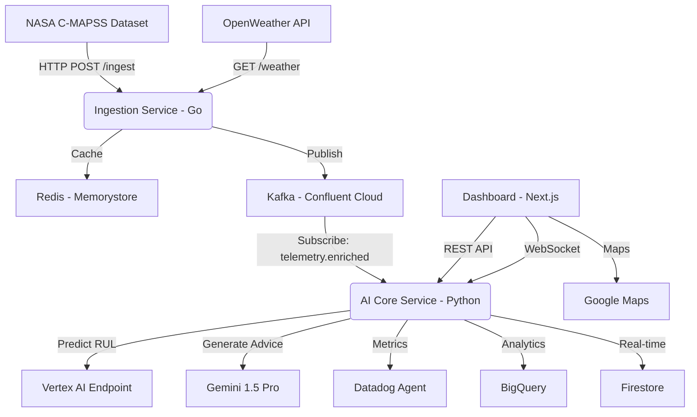

# 🚀 Aero-Sense: Intelligent Engine Health & MLOps Platform

[](https://opensource.org/licenses/MIT)
[](https://cloud.google.com)
[](https://www.datadoghq.com)
[](https://confluent.cloud)
[](https://golang.org)
[](https://python.org)
[](https://nextjs.org)

> **Predictive Maintenance for Aircraft Engines** powered by Vertex AI, Gemini 1.5 Pro, and Real-time Event Streaming

Aero-Sense is a **production-grade predictive maintenance platform** that combines NASA C-MAPSS jet engine simulation data with live weather data to calculate **Remaining Useful Life (RUL)** in real-time. Built with Google Cloud Native technologies, our polyglot microservices architecture leverages Go for high-performance data ingestion, Python with Vertex AI for intelligent predictions, and Next.js for an interactive dashboard.

**Developed for:** [Google Cloud Partner Catalyst Hackathon 2025](https://googlecloudpartner.devpost.com/)
**Challenge Categories:** Datadog (Observability) • Confluent (Real-time AI) • ElevenLabs (optional)

---

## 📋 Table of Contents

- [Features](#-features)
- [Architecture](#-architecture)
- [Tech Stack](#-tech-stack)
- [Quick Start](#-quick-start)
- [Installation](#-installation)
- [Usage](#-usage)
- [API Documentation](#-api-documentation)
- [Datadog Integration](#-datadog-integration)
- [Confluent Integration](#-confluent-integration)
- [Deployment](#-deployment)
- [Development](#-development)
- [Testing](#-testing)
- [Contributing](#-contributing)
- [License](#-license)

---

## ✨ Features

### Core Capabilities

- 🔮 **Predictive Maintenance:** XGBoost-based RUL estimation with Vertex AI deployment
- 🌊 **Hybrid Data Streams:** Real-time sensor telemetry + live weather data via Confluent Kafka
- 🤖 **GenAI Insights:** Gemini 1.5 Pro generates contextual maintenance recommendations
- 📊 **Full Observability:** End-to-end monitoring with Datadog (metrics, traces, logs, APM)
- ☁️ **Cloud Native:** Serverless architecture on Google Cloud Run with auto-scaling
- 🗄️ **Dual Storage:** BigQuery (analytics) + Firestore (real-time access)
- 🌍 **Geospatial Context:** Google Maps integration for flight location visualization
- ⚡ **High Performance:** Redis caching layer for weather API optimization

### Hackathon Requirements Coverage

#### ✅ Datadog Challenge
- [x] LLM-based application (Gemini 1.5 Pro)
- [x] 3+ Detection Rules (RUL anomaly, latency, cost spike)
- [x] Incident/Case automation
- [x] Custom dashboard with SLOs
- [x] Telemetry streaming (metrics, traces, logs)
- [x] JSON configuration exports

#### ✅ Confluent Challenge
- [x] Real-time data streaming (Kafka)
- [x] AI on data in motion (Vertex AI inference)
- [x] Novel use case (aerospace predictive maintenance)
- [x] Production-ready architecture

---

## 🏗️ Architecture

### System Overview



### Data Flow

1. **Ingestion:** Go service reads NASA telemetry, enriches with weather data (Redis cache), publishes to Kafka
2. **Processing:** Python service consumes Kafka messages, predicts RUL via Vertex AI
3. **AI Enhancement:** Low RUL triggers Gemini API for maintenance recommendations
4. **Observability:** All metrics pushed to Datadog (StatsD protocol)
5. **Storage:** Results stored in BigQuery (batch analytics) and Firestore (real-time queries)
6. **Visualization:** Next.js dashboard displays RUL gauges, maps, and Datadog graphs

---

## 🛠️ Tech Stack

### Services Layer

| Component | Technology | Purpose | GCP Service |
|-----------|-----------|---------|-------------|
| **Ingestion** | Go 1.21 | High-throughput data producer | Cloud Run |
| **AI Core** | Python 3.11 + FastAPI | ML inference & LLM orchestration | Cloud Run |
| **Dashboard** | Next.js 14 + TypeScript | Interactive UI | Cloud Run |

### Data Layer

| Component | Technology | Purpose | Provider |
|-----------|-----------|---------|----------|
| **Message Queue** | Apache Kafka | Event streaming | Confluent Cloud |
| **Cache** | Redis 7 | Weather API caching | Memorystore |
| **Analytics DB** | SQL | Long-term metrics | BigQuery |
| **Real-time DB** | NoSQL | Live telemetry | Firestore |

### AI/ML Stack

- **Model Training:** XGBoost 2.0, scikit-learn
- **Deployment:** Vertex AI Custom Prediction
- **GenAI:** Gemini 1.5 Pro via Vertex AI Studio
- **Data:** NASA C-MAPSS dataset (FD001)

### Observability

- **Monitoring:** Datadog (APM, Metrics, Logs)
- **Metrics:** Custom namespace `aero.*`
- **Tracing:** Distributed tracing across all services
- **Alerting:** 3+ detection rules with incident automation

### Infrastructure

- **IaC:** Terraform
- **Container Registry:** Google Container Registry (GCR)
- **Networking:** VPC with private IPs
- **Security:** Secret Manager, IAM roles

---

## 🚀 Quick Start

### Prerequisites

- Docker & Docker Compose
- Python 3.11+
- Go 1.21+ (optional, for local development)
- Node.js 18+ (optional, for UI development)
- Google Cloud account with credits
- Confluent Cloud account (free trial: code `CONFLUENTDEV1`)
- Datadog account (free trial available)

### 1. Clone Repository

```bash
git clone https://github.com/aero-sense/aero-sense.git
cd aero-sense
```

### 2. Environment Setup

```bash
# Copy environment template
cp .env.example .env

# Edit .env with your credentials
nano .env  # or use your favorite editor
```

**Required Environment Variables:**
- `DATADOG_API_KEY` - Get from [Datadog](https://app.datadoghq.com/account/settings#api)
- `KAFKA_BOOTSTRAP_SERVERS` - Confluent Cloud broker URL
- `KAFKA_SASL_USERNAME` & `KAFKA_SASL_PASSWORD` - Confluent API keys
- `OPENWEATHER_API_KEY` - Get from [OpenWeatherMap](https://openweathermap.org/api)
- `GEMINI_API_KEY` - Get from [Google AI Studio](https://makersuite.google.com/app/apikey)

### 3. Download NASA Dataset

```bash
cd scripts
chmod +x download-nasa-data.sh
./download-nasa-data.sh
```

### 4. Start Local Services

```bash
# Start infrastructure only (Kafka, Redis, Postgres, Datadog)
docker-compose up -d

# Or start full stack (includes application services)
docker-compose --profile full-stack up -d
```

### 5. Verify Services

```bash
# Check service health
docker-compose ps

# View logs
docker-compose logs -f

# Access UIs:
# - Kafka UI: http://localhost:8080
# - Redis Commander: http://localhost:8081
# - Dashboard (if full-stack): http://localhost:3000
```

---

## 📦 Installation

### Development Setup

#### Option A: Using Docker (Recommended)

```bash
# Infrastructure only
docker-compose up -d

# Build and run specific service
docker-compose up --build ingestion-service
```

#### Option B: Local Development

**Ingestion Service (Go)**
```bash
cd services/ingestion-go
go mod download
go run cmd/main.go
```

**AI Core Service (Python)**
```bash
cd services/ai-core-py
python -m venv venv
source venv/bin/activate  # Windows: venv\Scripts\activate
pip install -r requirements.txt
uvicorn app.main:app --reload
```

**Dashboard (Next.js)**
```bash
cd services/web-ui
npm install
npm run dev
```

### Model Training

```bash
cd models
pip install -r requirements.txt

# Preprocess data
python preprocessing.py

# Train XGBoost model
python train_xgboost.py

# Deploy to Vertex AI (requires GCP setup)
python vertex_deploy.py
```

---

## 💻 Usage

### Ingestion API

**Endpoint:** `POST /ingest/batch`

```bash
curl -X POST http://localhost:8000/ingest/batch \
  -H "Content-Type: application/json" \
  -d '{
    "flight_id": "FL-2025-NYC",
    "location": {"lat": 40.7128, "lon": -74.0060},
    "sensors": {
      "fan_speed": 2388.05,
      "core_temp": 1400.2,
      "pressure": 554.3
    }
  }'
```

### AI Core API

**Endpoint:** `GET /predictions/{flight_id}`

```bash
curl http://localhost:8001/predictions/FL-2025-NYC
```

**Response:**
```json
{
  "flight_id": "FL-2025-NYC",
  "predicted_rul": 45.3,
  "confidence": 0.92,
  "maintenance_advice": "Engine operating within normal parameters. Next inspection recommended in 40 cycles.",
  "timestamp": "2025-12-07T10:00:00Z"
}
```

### Dashboard UI

Access the dashboard at `http://localhost:3000`

**Features:**
- Real-time RUL gauge
- Google Maps with flight location
- Telemetry time-series charts
- Gemini-powered maintenance recommendations
- Embedded Datadog dashboards

---

## 📚 API Documentation

Full API documentation available via:
- Swagger UI: `http://localhost:8001/docs`
- ReDoc: `http://localhost:8001/redoc`
- OpenAPI JSON: `http://localhost:8001/openapi.json`

---

## 📊 Datadog Integration

### Custom Metrics

| Metric Name | Type | Description |
|-------------|------|-------------|
| `aero.ingestion.rate` | gauge | Messages ingested per second |
| `aero.weather.api_latency` | histogram | OpenWeather API response time |
| `aero.model.rul_prediction` | gauge | Predicted RUL value |
| `aero.model.inference_latency` | histogram | Vertex AI inference time |
| `aero.genai.cost` | gauge | Estimated Gemini API cost |
| `aero.kafka.consumer_lag` | gauge | Kafka consumer lag |

### Detection Rules

1. **RUL Anomaly Alert** - Triggers when RUL < 10 cycles
2. **Inference Latency Alert** - Triggers when p95 > 2s
3. **Gemini Cost Spike Alert** - Triggers when cost increases >200% in 5min

### Dashboards

Import pre-configured dashboards from `monitoring/dashboards/`:
- `aero-sense-main.json` - Main system dashboard
- `aero-sense-ml.json` - ML model performance
- `aero-sense-kafka.json` - Kafka metrics

---

## 🌊 Confluent Integration

### Kafka Topics

- **telemetry.enriched** (3 partitions, 7-day retention)
  - Producer: Ingestion Service
  - Consumer: AI Core Service
  - Schema: JSON (sensor data + weather context)

### Setup

```bash
# Create topic (via Confluent Cloud UI or CLI)
confluent kafka topic create telemetry.enriched \
  --partitions 3 \
  --config retention.ms=604800000

# Verify
confluent kafka topic describe telemetry.enriched
```

---

## 🚢 Deployment

### Google Cloud Platform

#### 1. Prerequisites

```bash
# Install gcloud CLI
# https://cloud.google.com/sdk/docs/install

# Authenticate
gcloud auth login
gcloud config set project YOUR_PROJECT_ID
```

#### 2. Deploy with Terraform

```bash
cd infra

# Initialize
terraform init

# Plan
terraform plan -var="project_id=YOUR_PROJECT_ID"

# Apply
terraform apply -auto-approve
```

#### 3. Deploy Services

```bash
# Build and push images
./scripts/deploy.sh

# Or manually:
gcloud builds submit --tag gcr.io/PROJECT_ID/ingestion-go services/ingestion-go
gcloud builds submit --tag gcr.io/PROJECT_ID/ai-core-py services/ai-core-py
gcloud builds submit --tag gcr.io/PROJECT_ID/web-ui services/web-ui

# Deploy to Cloud Run
gcloud run deploy ingestion-service --image gcr.io/PROJECT_ID/ingestion-go --region us-central1
gcloud run deploy ai-core-service --image gcr.io/PROJECT_ID/ai-core-py --region us-central1
gcloud run deploy dashboard-ui --image gcr.io/PROJECT_ID/web-ui --region us-central1
```

---

## 🔧 Development

### Project Structure

```
aero-sense/
├── services/
│   ├── ingestion-go/      # Go producer service
│   ├── ai-core-py/        # Python AI service
│   └── web-ui/            # Next.js dashboard
├── models/                # ML training scripts
├── infra/                 # Terraform IaC
├── monitoring/            # Datadog configs
├── data/                  # NASA dataset
└── scripts/               # Utility scripts
```

### Running Tests

```bash
# Go tests
cd services/ingestion-go
go test ./...

# Python tests
cd services/ai-core-py
pytest tests/ --cov=app

# Next.js tests
cd services/web-ui
npm test
```

### Code Quality

```bash
# Go
gofmt -w .
golangci-lint run

# Python
black app/
ruff check app/
mypy app/

# TypeScript
npm run lint
npm run type-check
```

---

## 🧪 Testing

### Load Testing

Generate traffic with the included script:

```bash
cd scripts
python traffic-generator.py --rate 100 --duration 300
```

**Parameters:**
- `--rate`: Messages per second
- `--duration`: Test duration (seconds)
- `--flight-id`: Custom flight ID

---

## 📹 Demo

**Video:** [3-Minute Demo on YouTube](https://youtube.com/watch?v=xxx)

**Screenshot:**


---

## 🤝 Contributing

We welcome contributions! Please see [CONTRIBUTING.md](CONTRIBUTING.md) for guidelines.

### Development Workflow

1. Fork the repository
2. Create a feature branch (`git checkout -b feature/amazing-feature`)
3. Commit changes (`git commit -m 'Add amazing feature'`)
4. Push to branch (`git push origin feature/amazing-feature`)
5. Open a Pull Request

---

## 📄 License

This project is licensed under the **MIT License** - see the [LICENSE](LICENSE) file for details.

---

## 🙏 Acknowledgments

- **NASA Ames Research Center** for C-MAPSS dataset
- **Google Cloud** for infrastructure support
- **Datadog** for observability platform
- **Confluent** for Kafka streaming
- **OpenWeatherMap** for weather API

---

## 📧 Contact

**Aero-Sense Team**
- Website: [aero-sense.com](https://aero-sense.com)
- GitHub: [@aero-sense](https://github.com/aero-sense)
- Email: team@aero-sense.com

**Hackathon Submission**
- DevPost: [Aero-Sense Project](https://devpost.com/software/aero-sense)
- Demo Video: [YouTube](https://youtube.com/watch?v=xxx)

---

**Built with ❤️ for Google Cloud Partner Hackathon 2025**
