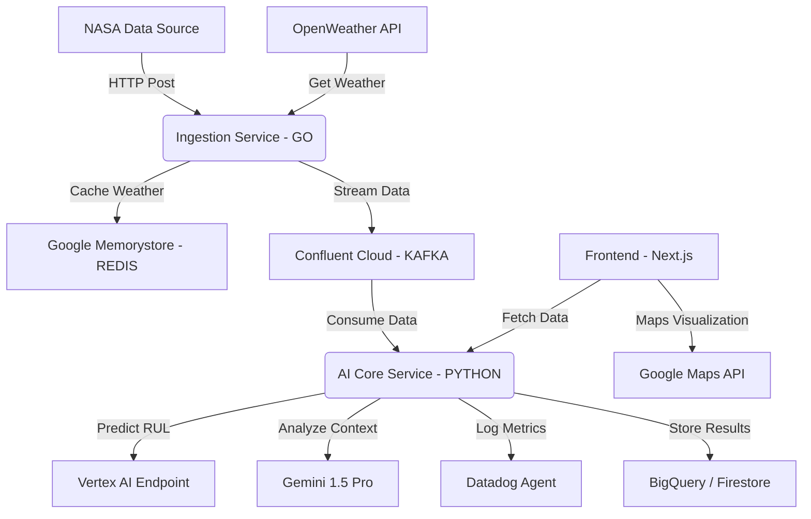
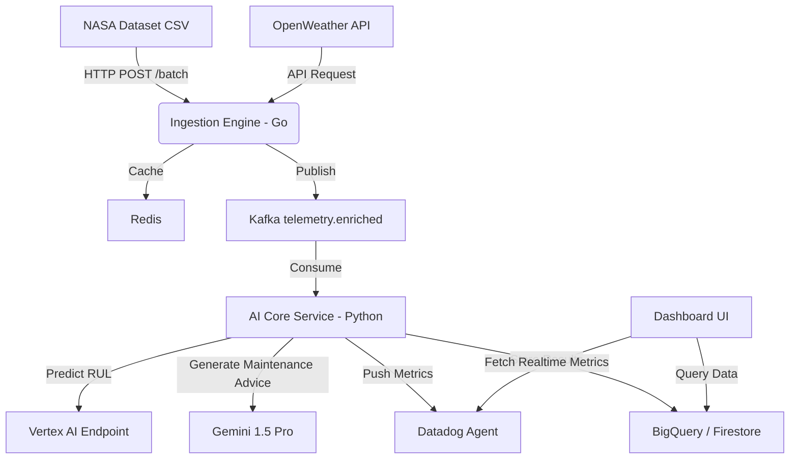

📂 **PROJECT MASTER FILE: AERO-SENSE**

**Project Name:** Aero-Sense: Intelligent Engine Health & MLOps Platform  
**Hackathon:** Google Cloud Partner Hackathon (Datadog & Confluent Challenges)  
**Tech Stack:** Google Cloud Native (Cloud Run, Vertex AI) + Polyglot (Go, Python, TypeScript)  
**Architectural Style:** Event-Driven Microservices  
**Date:** December 2025  

---

# 1. 📄 Product Requirements Document (PRD)

## 1.1. Problem Statement
Havacılık sektöründe motor arızaları (Engine Failures) maliyetli ve tehlikelidir. Mevcut sistemler genellikle reaktiftir (arıza olunca uyarır). Biz, **Google Vertex AI** gücünü kullanarak arızayı olmadan önce tahmin eden (Predictive Maintenance) ve arıza durumunda **Gemini ile mühendisler için teknik reçete oluşturan** “Otonom” bir sistem kuruyoruz.

## 1.2. Solution Overview
**"Aero-Sense"**, NASA'nın jet motoru verilerini (simülasyon) ve canlı hava durumu verilerini (OpenWeatherMap API) birleştiren bir IoT platformudur. Sistem, motorun **Kalan Ömrünü (RUL - Remaining Useful Life)** hesaplar ve tüm bu süreci **Datadog üzerinden canlı izler.**

## 1.3. Key Features
- **High-Performance Ingestion (Golang):** Yüksek frekanslı sensör verisini düşük gecikmeyle işler.  
- **Hybrid Data Stream (Confluent Kafka):** Statik sensör verisi + canlı hava durumu verisi.  
- **AI Core (Vertex AI & Gemini):**  
  - Custom XGBoost RUL Model  
  - Gemini 1.5 Pro ile teknik bakım çözüm önerileri  
- **Full Observability (Datadog):** Model Drift, API Latency, System Health takibi  

---

# 2. 🏗️ Technical Specifications & Architecture

## 2.1. System Architecture Diagram (Conceptual)


## 2.2. Tech Stack Details

| Component  | Technology        | Google Cloud Service | Reason                          |
|------------|-------------------|-----------------------|----------------------------------|
| Ingestion  | Go (Golang)       | Cloud Run             | High throughput, low CPU         |
| Processing | Python (FastAPI)  | Cloud Run             | Rich AI ecosystem                |
| ML Model   | XGBoost           | Vertex AI Training    | Strong for tabular sensor data   |
| GenAI      | Gemini 1.5 Pro    | Vertex AI Studio      | Multimodal reasoning             |
| Streaming  | Kafka             | Confluent Cloud       | Reliable event streaming         |
| Cache      | Redis             | Memorystore           | Reduces API latency              |
| Frontend   | Next.js           | Cloud Run             | SSR + modern UI                  |
| Infra      | Terraform         | —                     | IaC                               |
| Monitoring | Datadog           | —                     | Full observability                |

---

# 3. 🧩 Microservices Specification

## **Service A: ingestion-engine (Golang)**

**Role:** Data Producer  
**Responsibilities:**  
- NASA CMAPSS dataset'i satır satır okur  
- Redis’ten hava durumu kontrol eder; yoksa API’dan çeker  
- SensorData + WeatherData → Kafka’ya gönderir  

**Key Libraries:**  
`sarama`, `redigo`, `gin`

---

## **Service B: ai-core (Python)**

**Role:** Data Consumer & Intelligence  
**Responsibilities:**  
- Kafka’dan `telemetry.enriched` mesajlarını tüketir  
- Vertex AI RUL modeline gönderip tahmin alır  
- Eğer **Predicted_RUL < 20** ise Gemini’ye teknik teşhis prompt’u yollar  
- Datadog custom metrics push eder  

**Key Libraries:**  
`confluent-kafka`, `google-cloud-aiplatform`, `datadog`, `fastapi`

---

## **Service C: dashboard-ui (Next.js/TypeScript)**

**Role:** User Interface  
**Responsibilities:**  
- Gerçek zamanlı RUL göstergesi  
- Uçağın konumunu Google Maps üzerinde gösterme  
- Datadog grafikleri embed etme  
- Gemini’nin bakım reçetesini sunma  

**Key Libraries:**  
`framer-motion`, `google-maps-react`, `tailwindcss`

---

# 4. 📊 Data Schemas

## 4.1. Kafka Message Payload (JSON)

```json
{
  "flight_id": "FL-2025-NY",
  "timestamp": "2025-12-06T10:00:00Z",
  "location": {
    "lat": 40.7128,
    "lon": -74.0060
  },
  "external_context": {
    "temperature": 15.5,
    "humidity": 60
  },
  "sensors": {
    "fan_speed": 2388.05,
    "core_temp": 1400.2,
    "pressure": 554.3
  }
}
```
## 4.2. Datadog Custom Metrics

- **aero.ingestion.rate** – Messages per second (Go service)  
- **aero.weather.api_latency** – API fetch latency  
- **aero.model.rul_prediction** – Tahmin edilen kalan ömür  
- **aero.genai.cost** – Gemini maliyet tahmini  

---

# 5. 🛠️ Implementation Plan (DevOps & Git)

## 5.1. Directory Structure

/aero-sense-google-hackathon
├── /infra # Terraform files (GCP resources)
├── /services
│ ├── /ingestion-go # Golang Producer
│ ├── /ai-core-py # Python Consumer & Vertex Logic
│ └── /web-ui # Next.js Frontend
├── /data # Raw NASA datasets
├── /models # Training scripts for Vertex AI
└── /docs # Architecture images & PRD


## 5.2. Requirements for "Model Training"

- XGBoost regressor kullanılacak  
- Vertex AI Custom Training job ile eğitilecek  
- Model artifact şu dizine kaydedilecek:  
  **`gs://aero-sense-models/`**

---

# 6. 🎯 Success Criteria (Jury Checklist)

- **Integration:** Confluent → Python → Vertex AI → Datadog entegrasyonu başarılı mı?  
- **Innovation:** NASA + Live Weather hibrit veriyi kullanıyor mu?  
- **Google Native:** Backend Cloud Run’da mı? Gemini kullanıyor mu?  
- **Polyglot:** Go service yüksek performanslı mı?  
- **Observability:** Datadog panelleri aksiyon alınabilir şekilde mi?  

# 7. 📘 Hackathon Requirements Mapping (Partner Challenges → Aero-Sense Implementation)

Bu bölüm, Aero-Sense platformunun **Datadog**, **Confluent** ve isteğe bağlı olarak **ElevenLabs** challenge gereksinimlerini nasıl karşıladığını sistematik şekilde açıklar.

---

## 7.1. Datadog Challenge Mapping

**Challenge Özeti:**  
- Vertex AI veya Gemini tabanlı bir LLM uygulaması için uçtan uca gözlemlenebilirlik.  
- LLM sinyallerini Datadog'a aktarma (logs, metrics, traces, APM).  
- Dashboard + SLO + detection rules + incident automation.  
- 3+ detection rule zorunlu.  
- Olay tetiklendiğinde Datadog Incident / Case oluşturma.

### ✔ Aero-Sense Nasıl Karşılıyor?

| Gereksinim | Aero-Sense Uygulaması |
|-----------|------------------------|
| LLM-based application | Gemini 1.5 Pro ile bakım önerisi üreten servis |
| Telemetry → Datadog | ai-core tüm inference metriklerini gönderir: latency, cost, drift, prediction distribution |
| Dashboard | RUL trendleri, inference zamanları, Kafka lag, Redis latency, drift sinyalleri |
| Detection Rules (min 3) | 1) RUL anomaly < 10, 2) inference latency > threshold, 3) Gemini cost spike detection |
| Incident / Case Creation | Datadog API + webhook integration ile otomatik incident oluşturma |
| SLO | Model latency SLO, ingestion throughput SLO, LLM cost SLO |

---

## 7.2. Confluent Challenge Mapping

**Challenge Özeti:**  
- Gerçek zamanlı bir veri akışı üzerinde gelişmiş AI/ML teknikleri.  
- Confluent Cloud + Google Cloud AI entegrasyonu.  
- Veriyle gerçek zamanlı etkileşen “AI on data in motion” uygulaması.

### ✔ Aero-Sense Nasıl Karşılıyor?

| Gereksinim | Aero-Sense Uygulaması |
|-----------|------------------------|
| Real-time data stream | NASA CMAPSS sensör datası + canlı hava durumu |
| Confluent Cloud | telemetry.enriched topic + consumer group yapısı |
| AI model | Vertex AI XGBoost RUL Model |
| Real-time prediction | ai-core her mesajı işleyip RUL tahmini üretir |
| Novel use case | Havacılıkta gerçek zamanlı motor ömrü düşüşü takibi |
| Impact | Maintenance costs ↓, safety ↑ |

---

## 7.3. ElevenLabs Challenge Mapping (Opsiyonel Kullanım)

Aero-Sense ana çözümü için zorunlu değildir; ancak istenirse:

- Gemini bakım raporunu ElevenLabs Agents ile sesli şekilde okuyan bir **Konuşan Maintenance Assistant** eklenebilir.
- Uçuş mühendisleri için hands-free kullanım sağlar.

---

# 8. 🧮 Evaluation Strategy (Judging Criteria Alignment)

Bu bölüm, Aero-Sense’in jürinin 4 ana değerlendirme kriterine göre nasıl optimize edildiğini açıklar.

## 8.1. Technological Implementation
- Cloud Run üzerinde polyglot microservices: Go + Python + TypeScript.  
- Vertex AI Endpoints, Gemini API, Confluent Cloud, Datadog full-stack.  
- Infrastructure as Code: Terraform ile otomatik deployment.  
- End-to-end telemetry: logs, traces, metrics, LLM observability signals.  
- Redis caching ile API latency optimize edildi.

## 8.2. Design & UX
- RUL Gauge + real-time telemetry dashboard.  
- Google Maps üzerinde uçak konum & hava durumu overlay.  
- Gemini’den gelen teknik bakım önerileri okunabilir şekilde sunulur.  
- Minimal, hızlı ve intuitive UI (Next.js + Tailwind).

## 8.3. Potential Impact
- Havacılık sektöründe proaktif bakım → milyonlarca dolar maliyet tasarrufu.  
- Model Drift erken tespiti → emniyet artışı.  
- Diğer sektörlere uyarlanabilir (enerji, otomotiv, IoT).  

## 8.4. Quality of the Idea
- Hibrit veri yaklaşımı (NASA dataset + gerçek hava durumu).  
- LLM destekli otomatik maintenance engineering.  
- Tamamen Google Cloud Native + Partner ürünlerini derinlemesine kullanan uçtan uca tasarım.

---

# 9. 📦 Compliance & Submission Checklist

Hackathon teslim gereksinimleri ile tam uyum için Aero-Sense proje paketinin aşağıdaki içeriğe sahip olması zorunludur.

## 9.1. Required Project Artifacts

### ✔ Hosted Application URL  
- Cloud Run URL'si  
- Dashboard + UI erişimi

### ✔ Public GitHub Repository  
- OSI-approved license (MIT, Apache 2.0 vb.)  
- /infra, /services, /models, /docs klasörlerinin tamamı  
- README → Deployment talimatları  
- Datadog config exports (JSON):  
  - dashboards  
  - SLOs  
  - monitors  
  - detection rules  

### ✔ 3-Minute Demo Video  
- YouTube / Vimeo (public)  
- İçermesi gerekenler:  
  - Architecture walkthrough  
  - Datadog detection rule tetikleme örneği  
  - Confluent data pipeline  
  - Vertex AI inference  
  - Gemini bakım aksiyonu

### ✔ Selected Challenge  
- Datadog  
- Confluent  
- (Opsiyonel) ElevenLabs

---

## 9.2. Datadog Hard Requirements Checklist

| Requirement | Status |
|------------|--------|
| In-Datadog Health Dashboard | ✔ |
| 3+ Detection Rules | ✔ |
| Telemetry streaming (LLM + runtime) | ✔ |
| Actionable record (Incident/Case) | ✔ |
| Vertex AI / Gemini usage | ✔ |
| Traffic Generator Script | ✔ |
| JSON export of Datadog configs | ✔ |

---

## 9.3. Google Cloud Credits Policy Compliance
- Credits redeemed before **Dec 15, 2025**  
- Usage within 2 weeks  
- Spending monitored via Budgets & Alerts  

---

## 9.4. Confluent Cloud Requirements Checklist
- 30-day trial code: `CONFLUENTDEV1`  
- Enriched telemetry stream  
- Real-time predictions  
- AI on data in motion use case  

---

## 9.5. Optional ElevenLabs Integration
- Voice-based maintenance assistant  
- Real-time speech output for Gemini reports  

# 10. 🔄 Data Flow & Event Lifecycle (Veri Akışı ve Olay Döngüsü)

Bu bölüm, veri nasıl aktığını, işlendiğini ve sisteme nasıl entegre olduğunu detaylı olarak anlatır. Claude veya jüri sistemi için çok kritiktir.

## 10.1. Event Lifecycle Diagram


## 10.2. Event Handling Notes

- **Latency sensitive paths:** Ingestion → Kafka → AI Core

- **Failure handling:**
  - Redis cache miss → fetch from OpenWeather
  - Kafka publish/consume failures → retry 3x with exponential backoff
  - Vertex AI errors → log to Datadog, fallback to last prediction

- **Telemetry tracking:** ingestion rate, API latency, prediction time, model drift

- **Data persistence:** BigQuery for analytics, Firestore for real-time access

---

# 11. 👤 User Stories & Edge Cases (Kullanıcı Hikayeleri ve Kenar Durumlar)

Bu bölüm, sistemin **kullanıcı perspektifinden anlaşılmasını ve test edilebilirliğini** sağlar. Claude’un sistemi anlaması için kritik.

## 11.1. Primary User Stories

### Mühendis (Maintenance Engineer)
- "Uçağın motorunun kalan ömrünü gerçek zamanlı görmek istiyorum."
- "Motor arızası olasılığı düşük olan uçuşları planlayıp, bakım zamanını optimize etmek istiyorum."

### DevOps / Monitoring Lead
- "AI modelinin performansını ve latency’yi Datadog üzerinden izlemek istiyorum."
- "Model drift veya anomali olduğunda otomatik alarm alıp aksiyon almak istiyorum."

### Product Owner / Manager
- "Platformun uçtan uca veri akışını ve hava durumu entegrasyonunu görebilmek istiyorum."
- "Dashboard üzerinden kullanıcı deneyimini ölçmek ve raporlamak istiyorum."

---

## 11.2. Edge Cases & System Safeguards

| Edge Case                     | Mitigation                                                  |
|--------------------------------|------------------------------------------------------------|
| Sensör verisi eksik / hatalı   | AI Core, eksik verileri interpolate eder veya önceki değeri kullanır |
| OpenWeather API down           | Redis cache fallback veya default weather values          |
| Kafka backlog çok yüksek       | Metrics & alerts → auto-scale ingestion consumers         |
| Vertex AI downtime             | Fallback cached predictions + Datadog alert               |
| Gemini API rate limit exceeded | Queue system with retry & throttling                       |

---

## 11.3. Benefits for Claude

- Sistem mantığı, veri akışı ve hata senaryoları net olarak tanımlandı.  
- User intent ve sistem tepkisi açık şekilde eşleştirildi.  
- Edge case’ler sayesinde model, "ne zaman hangi fallback kullanılır" mantığını doğru anlayabilir.

