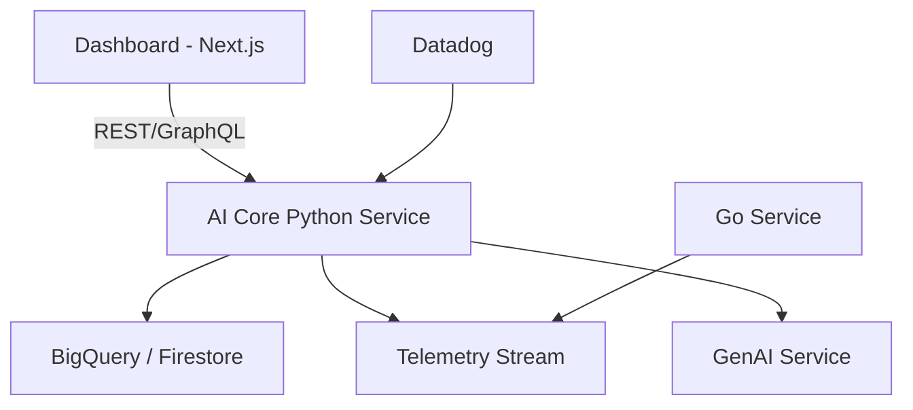
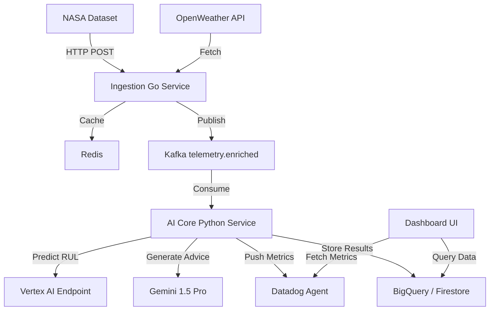

# 📌 Requirement Analysis: Aero-Sense Project

**Project:** Aero-Sense – Intelligent Engine Health & MLOps Platform  
**Hackathon:** Google Cloud Partner Hackathon (Datadog & Confluent Challenges)  
**Date:** December 2025  

---

# 1. 📝 Requirement Gathering Overview

Bu doküman, sistemin fonksiyonel ve fonksiyonel olmayan gereksinimlerini, önceliklerini ve mimari perspektifini netleştirir.  
Amaç: Claude ve insan jüri için sistemi anlaşılır ve test edilebilir hâle getirmek.

---

# 2. 🎯 Stakeholders

- **Maintenance Engineers:** Motor ömrü tahmini, teknik öneriler almak.  
- **DevOps / Monitoring Lead:** AI model performansı, latency ve Datadog gözlemlenebilirliği takip etmek.  
- **Product Owner / Manager:** Veri akışı, dashboard, sistem sağlığı ve raporlama.  
- **Hackathon Judges:** Yenilik, entegrasyon, Google Cloud Native kullanımını değerlendirmek.

---

# 3. 🏗️ Architectural Considerations

## 3.1 Onion Architecture Overview
```mermaid
graph TD
    A[Core Domain Layer] --> B[Application Layer]
    B --> C[Infrastructure Layer]
    C --> D[External Services (Kafka, Redis, OpenWeather)]
    C --> E[Cloud Services (Vertex AI, Cloud Run, BigQuery, Firestore)]
Core Domain Layer: RUL hesaplama, motor sağlığı mantığı

Application Layer: AI Core, mesaj işleme, model çağrıları

Infrastructure Layer: Microservices, Datadog, caching, event streaming

External Services: OpenWeather, NASA dataset, Confluent Kafka

```
## 3.2 Microservices / Layered Architecture

Microservices ile loosely coupled ve polyglot yapı

Layered architecture: Presentation → Application → Domain → Infrastructure

# 4. 📊 MoSCoW Requirement Analysis

| Priority | Requirement                        | Description                                                                 |
|----------|------------------------------------|-----------------------------------------------------------------------------|
| MUST     | Real-time RUL prediction           | AI model predicts engine Remaining Useful Life using sensor + weather data |
| MUST     | Kafka telemetry integration        | Sensor and weather data must flow to AI Core reliably                       |
| MUST     | Datadog observability              | Metrics, model drift, API latency, actionable alerts                        |
| SHOULD   | Gemini-based maintenance advice    | LLM generates technical recommendations when RUL < threshold                |
| SHOULD   | Google Cloud Native deployment     | Cloud Run backend, Vertex AI, Memorystore caching                            |
| COULD    | Voice interaction via ElevenLabs   | Conversational interface for maintenance instructions                        |
| WON'T    | On-premises sensor integration     | Hackathon scope limited to cloud simulation and live weather                 |

---

# 5. 💡 Functional Requirements

- Ingest NASA CMAPSS dataset (CSV)  
- Fetch weather data from OpenWeatherMap API  
- Cache external data (Redis)  
- Publish enriched telemetry to Kafka  
- Consume telemetry and call Vertex AI for RUL  
- Trigger Gemini LLM for actionable advice  
- Push custom metrics to Datadog  
- Visualize RUL + maintenance suggestions in Next.js dashboard  

---

# 6. ⚙️ Non-Functional Requirements

- **Performance:** Ingestion → Kafka → AI Core latency < 2s  
- **Scalability:** Kafka consumers auto-scale  
- **Reliability:** Retry policies for API & Kafka failures  
- **Security:** Secure API endpoints, Vertex AI access control  
- **Observability:** Datadog dashboards with SLOs, alerts, incidents  

---

# 7. 🔄 Event & Data Flow Diagram

# 8. 📌 User Stories

- **Maintenance Engineer:** "Uçağın motorunun kalan ömrünü gerçek zamanlı görmek istiyorum."  
- **DevOps Lead:** "Model drift veya anomali olduğunda otomatik alarm alıp aksiyon almak istiyorum."  
- **Product Owner:** "Dashboard üzerinden veri akışını ve kullanıcı deneyimini raporlamak istiyorum."  

---

# 9. ⚠️ Edge Cases

| Edge Case                     | Mitigation                                |
|--------------------------------|------------------------------------------|
| Sensor missing/faulty data     | Interpolation / last value fallback      |
| OpenWeather API down           | Redis fallback / default values          |
| Kafka backlog high             | Metrics alerts → auto-scale ingestion    |
| Vertex AI downtime             | Cached predictions + Datadog alert       |
| Gemini API rate limit exceeded | Queue + retry + throttling               |

---

# 10. 🏆 Benefits of Analysis

- Tüm gereksinimler net, MoSCoW öncelikli  
- Onion mimarisi ve microservices/layered diyagramlar sayesinde sistem mantığı net  
- Edge case’ler ve fallback senaryoları Claude ve jüri için anlaşılır  

---

# 11. 📚 References

- NASA CMAPSS Dataset: [https://www.nasa.gov/](https://www.nasa.gov/)  
- OpenWeatherMap API: [https://openweathermap.org/api](https://openweathermap.org/api)  
- Vertex AI: [https://cloud.google.com/vertex-ai](https://cloud.google.com/vertex-ai)  
- Gemini 1.5 Pro: Vertex AI Studio  
- Confluent Cloud: [https://www.confluent.io/](https://www.confluent.io/)  
- Datadog Observability: [https://www.datadoghq.com/](https://www.datadoghq.com/)
